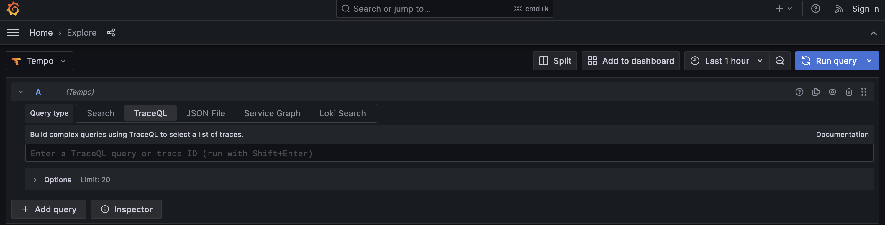

# Observability

Observability is the ability to understand and monitor the internal state and behavior of a system. It involves collecting data, metrics, logs, traces, and other relevant information to gain insights into how the system is performing, how it's behaving, and what might be causing any issues or anomalies. 

Observability helps developers, operators, and other stakeholders to effectively diagnose and troubleshoot problems, optimize performance, and ensure the reliability of their systems.

Key aspects of observability include:

**Metrics:** Quantitative measurements of various aspects of a system, such as CPU usage, memory consumption, request/response rates, error rates, etc.

**Logs:** Text-based records of events and activities within a system. Logs are useful for understanding the sequence of actions taken by the system and for identifying error messages or anomalies.

**Traces:** Distributed traces show the flow of requests as they move through different components and services in a system. Traces provide insights into the end-to-end journey of a request and help identify bottlenecks or latency issues.

**Events:** Specific occurrences or incidents that are noteworthy, often emitted by the system to indicate certain conditions or transitions.

**Correlation:** The ability to link data across different components, services, and layers of the system to form a coherent understanding of what's happening.

## How to run

### Pre requisite

- Docker should be installed

### Run

1. Clone the project, open in terminal/command prompt
2. Move to the [docker](./docker) folder
3. Run `docker compose up -d` command
   1. [app-api](./app) will be running on http://localhost:8080
   2. [user-api](./user) is running on http://localhost:8081
   3. DB connection is also exposed in `3312` port, please refer [docker compose](./docker/compose.yaml) file
   4. Grafana is running on http://localhost:3000
4. Hit `app-api` by calling http://localhost:8080/app/user?id=1 in browser
5. Go to Grafana dashboard and click on toggle menu

   
   
   ### Loki

6. Select Loki

   
7. We have to select label filters, which were added as part of [logback-spring.xml](./app/src/main/resources/logback-spring.xml) file

    
8. After selecting Label filters, click on Run query

    
9. Now we can see Logs volume and messages

    
10. Either copy Trace Id from Log messages or by clicking on the message we can Tempo

   

   ### Tempo

11. Select Tempo

   
12. Select Query type as TraceQL and copy the Trace Id, click on Run query

   
13. Now we can see the Service workflow by each operation and how much it took to perform that operation

   
14. We can see the same workflow in Node graph as well

   

   ### Prometheus

15. In same way select Prometheus and Let's check metric of `jvm_memory_used_bytes` of `heap` area

   
16. Now we can see the metrics of both the instances `app-api` and `user-api`

   

## OpenTelemetry

OpenTelemetry is an open-source project that aims to standardize and simplify observability in modern software systems. It provides a set of APIs, libraries, agents, and instrumentation to help developers capture and collect telemetry data (metrics, logs, and traces) from their applications and services. OpenTelemetry supports multiple programming languages and frameworks, making it suitable for a wide range of environments.
